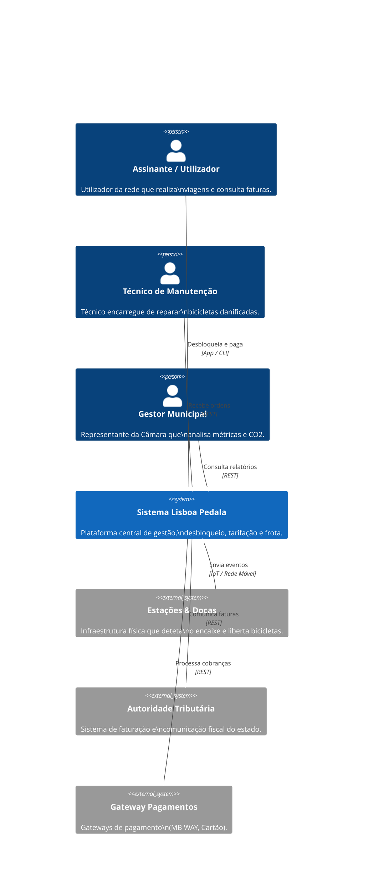

```mermaid
%%{init: {
  'theme': 'base',
  'themeVariables': {
    'primaryTextColor': '#ffffff',
    'secondaryTextColor': '#ffffff',
    'tertiaryTextColor': '#ffffff',
    'lineColor': '#ffffff',
    'textColor': '#ffffff'
  }
}}%%
C4Context
    title Diagrama de Contexto (C4 Nível 1) - Lisboa Pedala

    Person(assinante, "Assinante / Utilizador", "Utilizador da rede que realiza\nviagens e consulta faturas.")
    Person(tecnico, "Técnico de Manutenção", "Técnico encarregue de reparar\nbicicletas danificadas.")
    Person(gestor, "Gestor Municipal", "Representante da Câmara que\nanalisa métricas e CO2.")

    System(lisboa_pedala, "Sistema Lisboa Pedala", "Plataforma central de gestão,\ndesbloqueio, tarifação e frota.")

    System_Ext(docas, "Estações & Docas", "Infraestrutura física que deteta\no encaixe e liberta bicicletas.")
    System_Ext(at, "Autoridade Tributária", "Sistema de faturação e\ncomunicação fiscal do estado.")
    System_Ext(psp, "Gateway Pagamentos", "Gateways de pagamento\n(MB WAY, Cartão).")

    Rel(assinante, lisboa_pedala, "Desbloqueia e paga", "App / CLI")
    Rel(tecnico, lisboa_pedala, "Recebe ordens", "REST")
    Rel(gestor, lisboa_pedala, "Consulta relatórios", "REST")

    Rel(docas, lisboa_pedala, "Envia eventos", "IoT / Rede Móvel")
    Rel(lisboa_pedala, at, "Comunica faturas", "REST")
    Rel(lisboa_pedala, psp, "Processa cobranças", "REST")
```