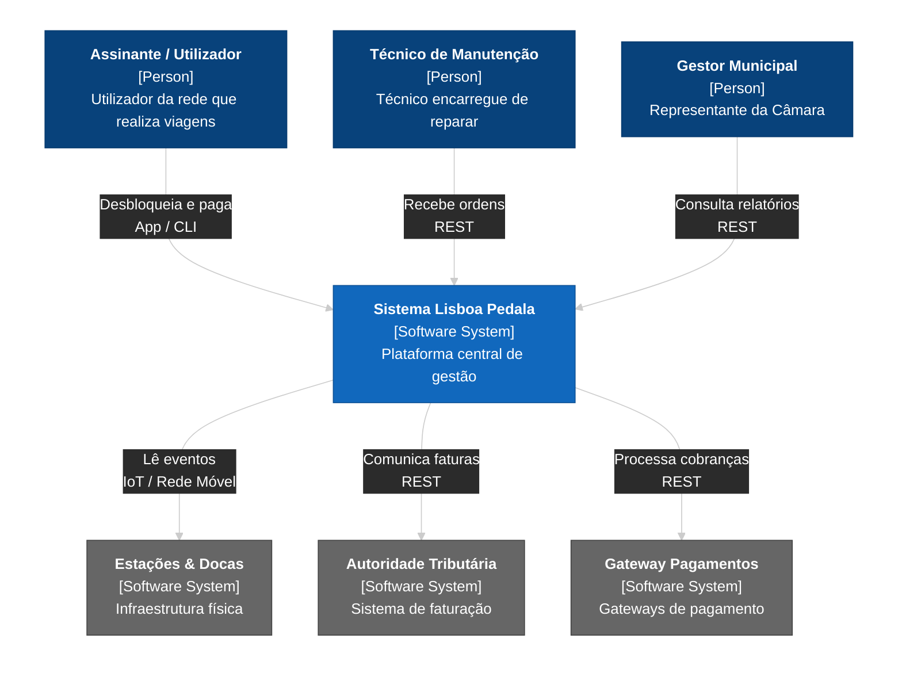

```mermaid
%%{init: {
  'theme': 'base',
  'themeVariables': {
    'edgeLabelBackground': '#2b2b2b',
    'primaryTextColor': '#ffffff',
    'secondaryTextColor': '#ffffff',
    'tertiaryTextColor': '#ffffff',
    'lineColor': '#cccccc',
    'textColor': '#ffffff'
  }
}}%%
graph TD
    classDef person fill:#08427b,stroke:#073b6f,color:#fff;
    classDef system fill:#1168bd,stroke:#0e5296,color:#fff;
    classDef external fill:#666666,stroke:#444444,color:#fff;

    subgraph Topo[" "]
        style Topo fill:none,stroke:none
        assinante["<b>Assinante / Utilizador</b><br/>[Person]<br/>Utilizador da rede que realiza viagens"]:::person
        tecnico["<b>Técnico de Manutenção</b><br/>[Person]<br/>Técnico encarregue de reparar"]:::person
        gestor["<b>Gestor Municipal</b><br/>[Person]<br/>Representante da Câmara"]:::person
    end

    subgraph Meio[" "]
        style Meio fill:none,stroke:none
        lisboa_pedala["<b>Sistema Lisboa Pedala</b><br/>[Software System]<br/>Plataforma central de gestão"]:::system
    end

    subgraph Base[" "]
        style Base fill:none,stroke:none
        docas["<b>Estações & Docas</b><br/>[Software System]<br/>Infraestrutura física"]:::external
        at["<b>Autoridade Tributária</b><br/>[Software System]<br/>Sistema de faturação"]:::external
        psp["<b>Gateway Pagamentos</b><br/>[Software System]<br/>Gateways de pagamento"]:::external
    end

    assinante -->|Desbloqueia e paga<br/>App / CLI| lisboa_pedala
    tecnico -->|Recebe ordens<br/>REST| lisboa_pedala
    gestor -->|Consulta relatórios<br/>REST| lisboa_pedala

    lisboa_pedala -->|Lê eventos<br/>IoT / Rede Móvel| docas
    lisboa_pedala -->|Comunica faturas<br/>REST| at
    lisboa_pedala -->|Processa cobranças<br/>REST| psp
```