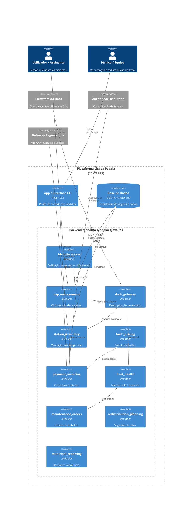

```mermaid
%%{init: {
  'theme': 'base',
  'themeVariables': {
    'primaryTextColor': '#ffffff',
    'secondaryTextColor': '#ffffff',
    'tertiaryTextColor': '#ffffff',
    'lineColor': '#cccccc',
    'textColor': '#ffffff'
  }
}}%%
C4Container
    title Diagrama de Contentores (C4 Nível 2) - Lisboa Pedala

    Person(user, "Utilizador / Assinante", "Pessoa que utiliza as bicicletas.")
    Person(tech, "Técnico / Equipa", "Manutenção e redistribuição da frota.")

    System_Ext(doca_hw, "Firmware da Doca", "Guarda eventos offline até 24h.")
    System_Ext(at_ext, "Autoridade Tributária", "Comunicação de faturas.")
    System_Ext(psp_ext, "Gateway Pagamentos", "MB WAY / Cartão de Crédito.")

    Container_Boundary(c1, "Plataforma Lisboa Pedala") {
        Container(cli_app, "App / Interface CLI", "Java / CLI", "Ponto de entrada dos pedidos.")
        ContainerDb(db, "Base de Dados", "SQLite / In-Memory", "Persistência de viagens e dados.")

        Container_Boundary(monolith, "Backend Monólito Modular (Java 21)") {
            Container(identity, "identity_access", "Módulo", "Validação de passes e utilizadores.")
            Container(trip, "trip_management", "Módulo", "Ciclo de vida das viagens.")
            Container(gateway, "dock_gateway", "Módulo", "Desduplicação de eventos.")
            Container(inventory, "station_inventory", "Módulo", "Ocupação em tempo real.")
            Container(pricing, "tariff_pricing", "Módulo", "Cálculo de tarifas.")
            Container(invoicing, "payment_invoicing", "Módulo", "Cobranças e faturas.")
            Container(fleet, "fleet_health", "Módulo", "Telemetria IoT e avarias.")
            Container(maint, "maintenance_orders", "Módulo", "Ordens de trabalho.")
            Container(redist, "redistribution_planning", "Módulo", "Sugestão de rotas.")
            Container(report, "municipal_reporting", "Módulo", "Relatórios municipais.")
        }
    }

    Rel(user, cli_app, "Utiliza", "CLI / REST")
    Rel(tech, cli_app, "Utiliza", "CLI / REST")
    Rel(doca_hw, gateway, "Envia eventos", "HTTPS")

    Rel(cli_app, trip, "Invoca")
    Rel(cli_app, inventory, "Invoca")
    
    Rel(gateway, trip, "Inicia/Fecha viagem")
    Rel(gateway, inventory, "Atualiza ocupação")
    Rel(gateway, fleet, "Alertas IoT")

    Rel(trip, identity, "Valida passe")
    Rel(trip, invoicing, "Pede cobrança")
    Rel(invoicing, pricing, "Calcula tarifa")
    Rel(fleet, maint, "Cria ordem")

    Rel(trip, db, "Lê/Escreve")
    Rel(inventory, db, "Lê/Escreve")

    Rel(invoicing, psp_ext, "Efetua cobrança", "HTTPS")
    Rel(invoicing, at_ext, "Submete fatura", "HTTPS")
```