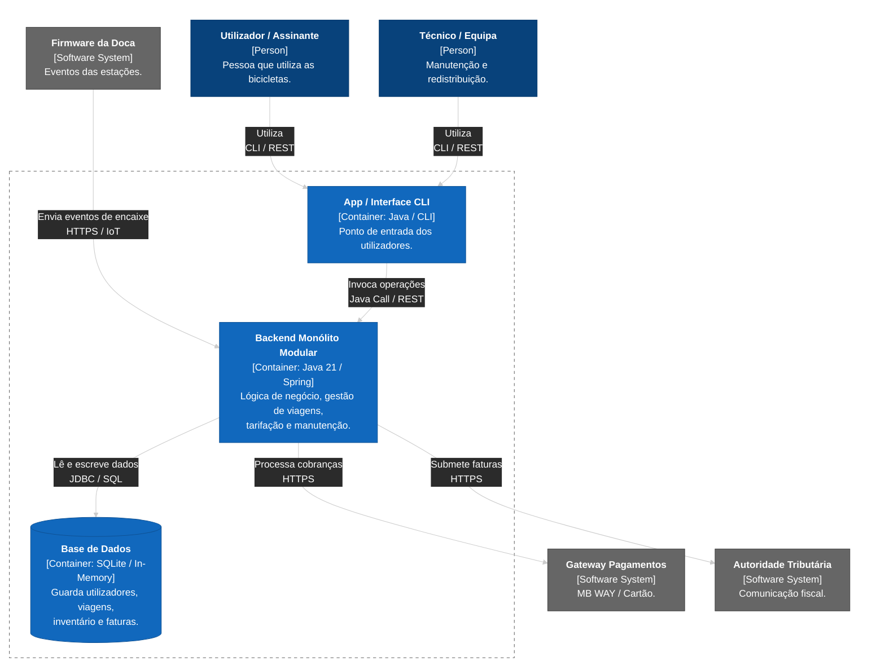

```mermaid
%%{init: {
  'theme': 'base',
  'themeVariables': {
    'edgeLabelBackground': '#2b2b2b',
    'primaryTextColor': '#ffffff',
    'secondaryTextColor': '#ffffff',
    'tertiaryTextColor': '#ffffff',
    'lineColor': '#cccccc',
    'textColor': '#ffffff'
  }
}}%%
graph TD
    classDef person fill:#08427b,stroke:#073b6f,color:#fff;
    classDef external fill:#666666,stroke:#444444,color:#fff;
    classDef container fill:#1168bd,stroke:#0e5296,color:#fff;
    classDef db fill:#1168bd,stroke:#0e5296,color:#fff;

    %% TOP LEVEL: ATORES E DISPOSITIVOS
    subgraph Topo[" "]
        style Topo fill:none,stroke:none
        user["<b>Utilizador / Assinante</b><br/>[Person]<br/>Pessoa que utiliza as bicicletas."]:::person
        tech["<b>Técnico / Equipa</b><br/>[Person]<br/>Manutenção e redistribuição."]:::person
        doca_hw["<b>Firmware da Doca</b><br/>[Software System]<br/>Eventos das estações."]:::external
    end

    %% MIDDLE LEVEL: PLATAFORMA LISBOA PEDALA
    subgraph Plataforma["Plataforma Lisboa Pedala [Container]"]
        style Plataforma fill:none,stroke:#666666,stroke-dasharray: 5 5,color:#ffffff
        cli_app["<b>App / Interface CLI</b><br/>[Container: Java / CLI]<br/>Ponto de entrada dos utilizadores."]:::container
        monolith["<b>Backend Monólito Modular</b><br/>[Container: Java 21 / Spring]<br/>Lógica de negócio, gestão de viagens,<br/>tarifação e manutenção."]:::container
        db[("<b>Base de Dados</b><br/>[Container: SQLite / In-Memory]<br/>Guarda utilizadores, viagens,<br/>inventário e faturas.")]:::db
    end

    %% BOTTOM LEVEL: SISTEMAS EXTERNOS
    subgraph Base[" "]
        style Base fill:none,stroke:none
        psp_ext["<b>Gateway Pagamentos</b><br/>[Software System]<br/>MB WAY / Cartão."]:::external
        at_ext["<b>Autoridade Tributária</b><br/>[Software System]<br/>Comunicação fiscal."]:::external
    end

    %% LIGAÇÕES SUPERIORES
    user -->|Utiliza<br/>CLI / REST| cli_app
    tech -->|Utiliza<br/>CLI / REST| cli_app
    doca_hw -->|Envia eventos de encaixe<br/>HTTPS / IoT| monolith

    %% LIGAÇÕES INTERNAS
    cli_app -->|Invoca operações<br/>Java Call / REST| monolith
    monolith -->|Lê e escreve dados<br/>JDBC / SQL| db

    %% LIGAÇÕES INFERIORES
    monolith -->|Processa cobranças<br/>HTTPS| psp_ext
    monolith -->|Submete faturas<br/>HTTPS| at_ext
```