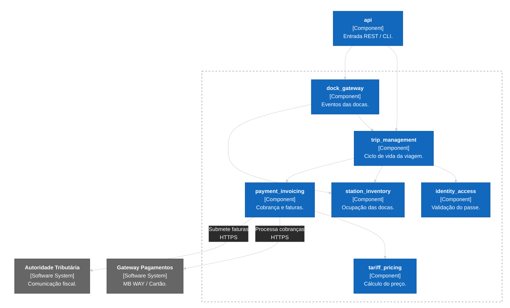

```mermaid
%%{init: {
  'theme': 'base',
  'themeVariables': {
    'edgeLabelBackground': '#2b2b2b',
    'primaryTextColor': '#ffffff',
    'secondaryTextColor': '#ffffff',
    'tertiaryTextColor': '#ffffff',
    'lineColor': '#cccccc',
    'textColor': '#ffffff'
  }
}}%%
graph TD
    classDef external fill:#666666,stroke:#444444,color:#fff;
    classDef component fill:#1168bd,stroke:#0e5296,color:#fff;

    %% TOP LEVEL: ENTRADA
    subgraph Topo[" "]
        style Topo fill:none,stroke:none
        api["<b>api</b><br/>[Component]<br/>Entrada REST / CLI."]:::component
    end

    %% MIDDLE LEVEL: COMPONENTES DO FLUXO DESBLOQUEAR, DEVOLVER, COBRAR
    subgraph Backend["Backend Monólito Modular [Container: Java 21]"]
        style Backend fill:none,stroke:#666666,stroke-dasharray: 5 5,color:#ffffff
        trip["<b>trip_management</b><br/>[Component]<br/>Ciclo de vida da viagem."]:::component
        dock["<b>dock_gateway</b><br/>[Component]<br/>Eventos das docas."]:::component
        ident["<b>identity_access</b><br/>[Component]<br/>Validação do passe."]:::component
        station["<b>station_inventory</b><br/>[Component]<br/>Ocupação das docas."]:::component
        pay["<b>payment_invoicing</b><br/>[Component]<br/>Cobrança e faturas."]:::component
        tariff["<b>tariff_pricing</b><br/>[Component]<br/>Cálculo do preço."]:::component
    end

    %% BOTTOM LEVEL: SISTEMAS EXTERNOS
    subgraph Base[" "]
        style Base fill:none,stroke:none
        psp_ext["<b>Gateway Pagamentos</b><br/>[Software System]<br/>MB WAY / Cartão."]:::external
        at_ext["<b>Autoridade Tributária</b><br/>[Software System]<br/>Comunicação fiscal."]:::external
    end

    api --> trip
    api --> dock
    dock --> trip
    dock --> station
    trip --> ident
    trip --> station
    trip --> pay
    pay --> tariff
    pay -->|Processa cobranças<br/>HTTPS| psp_ext
    pay -->|Submete faturas<br/>HTTPS| at_ext
```
